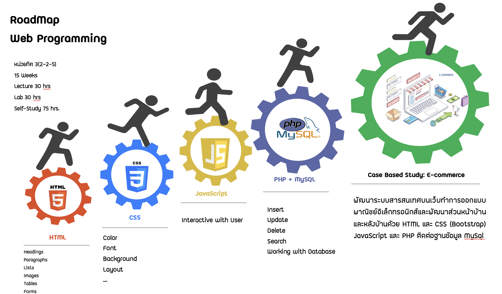

# Web programming

<!-- > Outline a brief description of your project.
> Live demo [_here_](https://www.example.com). If you have the project hosted somewhere, include the link here. -->
## Road Map

## Table of Contents
* [Course Description](#course-description)
* [Topics](#topics)
* [Contact](#contact)
<!-- * [License](#license) -->

## Course Description
Principles of web programming; web application development using popular languages; scripting languages, web formatting languages; web development for using database; framework for web development; practice corresponding with course
<!-- You don't have to answer all the questions - just the ones relevant to your project. -->

## Topics
- [Basic HTML](basichtml/README.md)
- CSS Fundamental
- CSS Framework: Bootstrap
- JavaScript
- PHP and MySQL

## Contact

Pattaraporn Warintarawej

31 Moo 6 Makamtai District, Muang, Surat Thani, Thailand 84000 
Faculty of Sciences and Industrail Technology 
Prince of Songkla University, Surat Thani Campus

